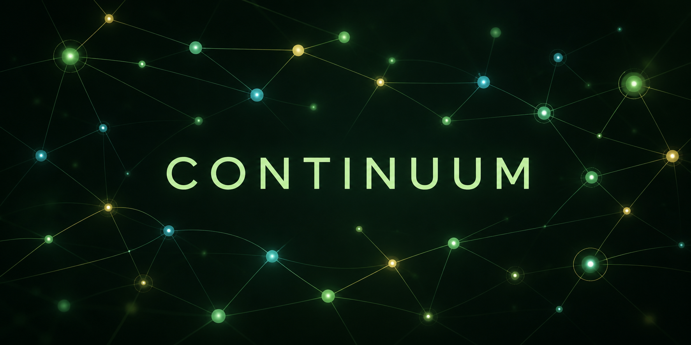

# Continuum — Community Edition



Run a production-style memory service locally, then connect it to the agent
framework you already use. Continuum is the self-hosted learning and
development distribution of the Continuum memory engine: Qdrant for semantic
recall, Neo4j for relationships, Redis for working state, and the Syntarus
API/SDK at the boundary.

It is intentionally simple to start and easy to remove. Your data stays in
the Docker volumes on your machine. The application never needs to know how
Qdrant, Neo4j, or Redis are wired together.

## Start locally

Requirements:

- Docker Desktop with Compose v2
- Python 3.10+ (only needed for the SDK examples)
- An extraction provider key for background memory extraction. Sarvam is the
  default production provider; Gemini can be used for local experiments.

From this directory:

```bash
cp .env.example .env             # macOS/Linux
copy .env.example .env           # Windows PowerShell
# Set SARVAM_API_KEY or GEMINI_API_KEY in .env when you want ingestion.
docker compose up -d --build
```

Check that the service is ready:

```bash
curl http://localhost:8000/health
curl http://localhost:8000/ready
```

The API is at `http://localhost:8000`. OpenAPI is at
`http://localhost:8000/docs`. The optional web console is started with:

```bash
docker compose --profile ui up -d --build
```

Then open `http://localhost:5173`.

The local development key is `sk_mem_community`. It is accepted only because
the example `.env` uses `MEMORYOS_ALLOW_OPEN=true`. Replace that setting and
configure `MEMORYOS_API_KEYS` before exposing the service beyond your
machine.

## First memory in five minutes

Install the SDK from this checkout and run the example:

```bash
python -m venv .venv
python -m pip install -e ./sdk
set SYNTARUS_API_KEY=sk_mem_community       # Windows PowerShell: $env:...
python examples/python/quickstart.py
```

The example writes one turn, waits for the durable ingestion event, and then
searches it back. `wait_for_event` is important: a successful HTTP write means
the event was accepted, not that extraction has finished.

```python
from syntarus import MemoryClient

with MemoryClient(api_key="sk_mem_community", base_url="http://localhost:8000/v1") as memory:
    accepted = memory.add(
        user_id="demo-user",
        agent_id="demo-agent",
        messages=[{"role": "user", "content": "I prefer short status updates."}],
    )
    memory.wait_for_event(accepted["event_id"])
    print(memory.search("How should I receive updates?", user_id="demo-user")["context"])
```

## The integration pattern

Every agent framework follows the same three calls. Keep the API key on the
server or local agent process, never in a browser or mobile bundle.

```text
user message
     │
     ├─ memories.search(query, user_id, agent_id) ──► context for the model
     │                                                   │
     └─ model / tools / agent graph ◄────────────────────┘
             │
             └─ memories.add(turn, run_id) ──► durable background extraction
```

Use a stable `user_id` for the person or tenant, a stable `agent_id` for each
agent that should have an isolated memory namespace, and a `run_id` for one
conversation or job. Omit `agent_id` only when all agents should share the
same user profile.

## Agent framework recipes

The `integrations/` directory contains copy-and-adapt recipes. They are
deliberately provider-neutral: use OpenAI, Anthropic, Gemini, Groq, Sarvam,
Ollama, or a self-hosted model without changing the memory layer.

| Runtime | What is included | Recommended use |
|---|---|---|
| LangChain | `langchain.py` and a small history adapter | Add memory before the model call and save after it |
| LangGraph | `langgraph.py` nodes | Put recall and remember nodes around your graph |
| Deep Agents | `deep-agents.md` | Add memory as a bounded context tool and checkpoint |
| Hermes | `hermes.md` | Register `syntarus_search` and `syntarus_remember` tools |
| OpenClaw | `openclaw.md` + MCP snippet | Expose search/remember through the MCP tool boundary |
| NemoClaw | `nemoclaw.md` | Use the same HTTP contract from a sandboxed tool |
| Any agent | `generic.py` | Two functions: `recall()` and `remember()` |

LangChain and LangGraph examples are runnable when their optional packages
are installed. The Deep Agents, Hermes, OpenClaw, and NemoClaw recipes use
their documented tool/MCP boundaries rather than pretending there is one
universal Python API. That keeps the examples honest as those projects evolve.

## Local data and reset

Continuum uses volume names prefixed with `continuum_ce_`; it will not
reuse or delete the volumes from the main development or production compose
files.

```bash
docker compose down                  # stop containers, keep data
docker compose down -v               # delete Community Edition data
docker compose logs -f backend       # inspect ingestion and API errors
```

The local stack binds Qdrant, Neo4j, Redis, and Postgres to loopback ports for
debugging. Do not publish those ports on an internet-facing host. For a real
deployment, use the production compose overlay, private networking, a strong
Neo4j password, `MEMORYOS_ALLOW_OPEN=false`, and a scoped project key.

## What is included — and what is not

Included:

- the same FastAPI memory API and official Python SDK boundary;
- asynchronous ingestion events, idempotent writes, search, export, and
  deletion;
- vector, sparse, entity, and graph-backed retrieval from the local stores;
- examples for common agent runtimes and an MCP configuration pattern;
- isolated local volumes and a reset command for development.

Continuum is not the hosted Syntarus control plane. Hosted-only
features such as managed upgrades, multi-region failover, hosted billing,
enterprise SSO, and a vendor-operated SLA are not implied by this repository.
The benchmark numbers in this repository are reproducibility material, not a
guarantee for every model, dataset, hardware setup, or prompt.

## Useful links

- [Python SDK](sdk/README.md)
- [API reference](https://www.syntarus.com/pages/api-reference)
- [Developer console](https://www.syntarus.com/pages/developers)
- [Security and reliability](https://www.syntarus.com/pages/security)
- [Project license](sdk/LICENSE)
